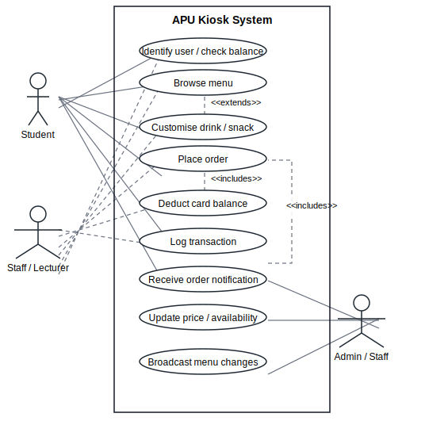
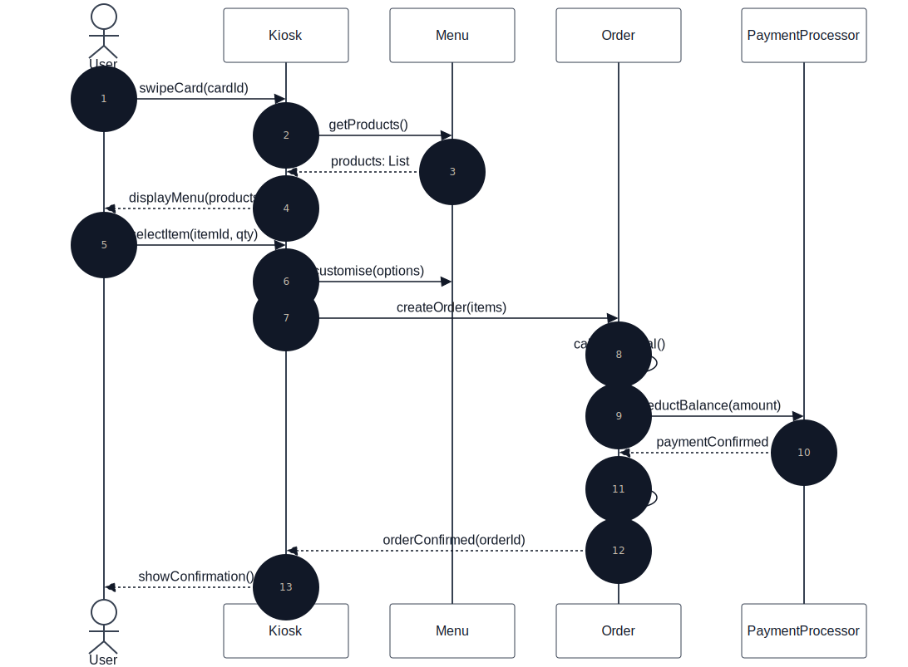
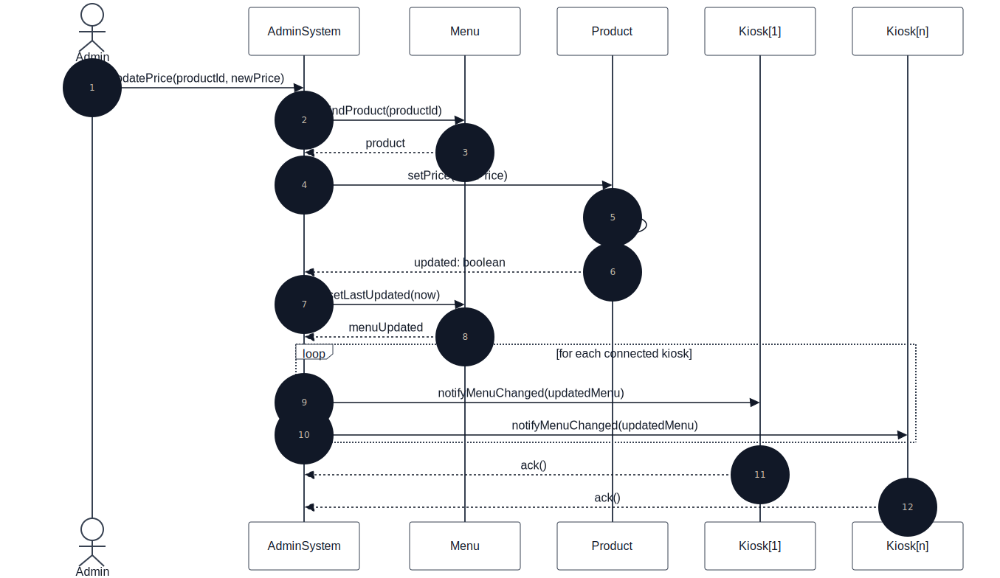
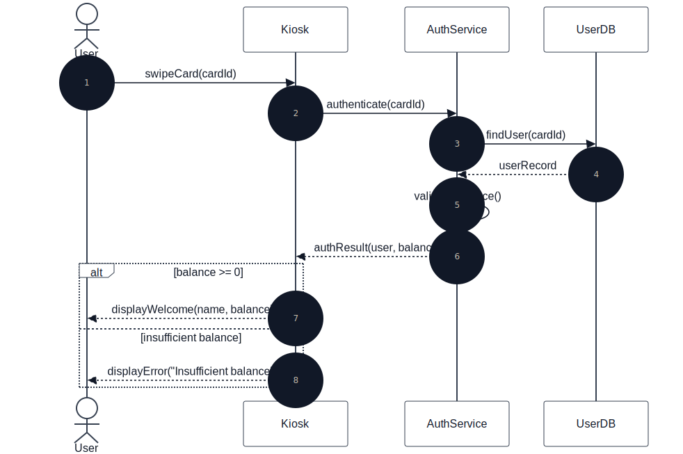
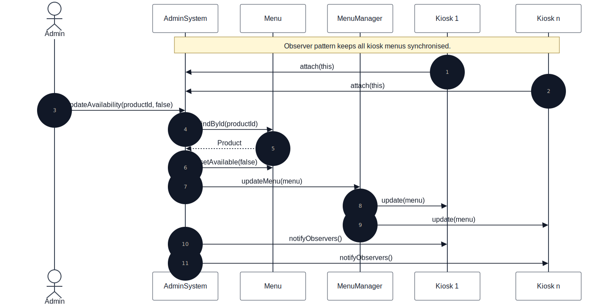
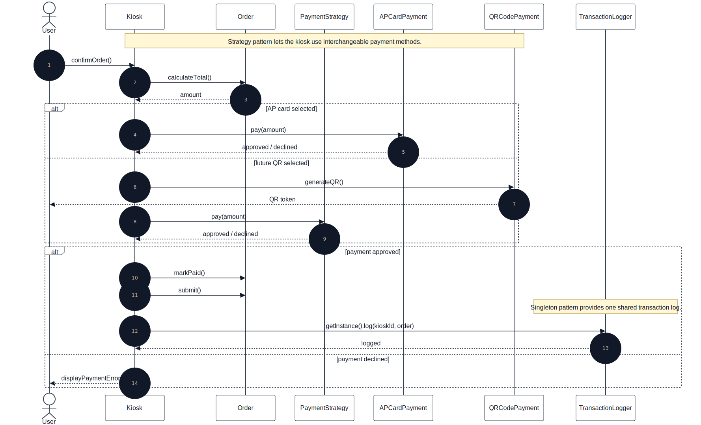

<section class="cover-page">

<p class="cover-kicker">Object Modelling with UML</p>

# OMU Mini Project Final Report

## APU Campus Wide Drinks and Snack Ordering Kiosk System

| Report Item | Details |
| --- | --- |
| Institution | Asia Pacific University of Technology and Innovation |
| Module | Object Modelling with UML |
| Assessment | OMU Mini Project |
| Submission Type | UML Report and Java Skeletal Implementation |
| Academic Year | 2026 |
| Group Members | Feriel Dekhili, Linda Abdessalem, Sarah Benhammadi |
| Main Design Sources | Uploaded UXF diagrams and assignment brief |

<p class="cover-note">In this report, we present our UML analysis, our design decisions, the Java skeleton, and our evaluation of the proposed kiosk ordering system.</p>

</section>

<div class="page-break"></div>

## Sommaire

| Section | Title | Purpose |
| --- | --- | --- |
| 1 | Introduction and Project Plan | Defines the scenario, objectives, stakeholders, and scope. |
| 2 | Analysis and UML Design | Presents the use case, class, and sequence diagrams. |
| 3 | Design Pattern Refinement | Explains Observer, Strategy, and Singleton in the refined model. |
| 4 | Implementation | Maps the UML model to the Java skeleton. |
| 5 | Scenario Walkthrough | Summarises the customer and admin flows. |
| 6 | Compliance Assessment | Checks the submission against the assignment requirements. |
| 7 | Critical Appraisal | Evaluates strengths, limitations, risks, and pattern suitability. |
| 8 | Conclusion and Future Enhancements | Closes the report and proposes future work. |
| 9 | References | Lists sources used for the assignment. |

## List of Figures

| Figure | Diagram | Source |
| --- | --- | --- |
| Figure 1 | High-level use case diagram | `01_use_case_diagram.uxf` |
| Figure 2 | Initial class diagram without design patterns | `02_class_diagram_no_patterns.uxf` |
| Figure 3 | Place order sequence diagram | `03_sequence_place_order.uxf` |
| Figure 4 | Update menu sequence diagram | `04_sequence_update_menu.uxf` |
| Figure 5 | Authenticate user sequence diagram | `05_sequence_authenticate_user.uxf` |
| Figure 6 | Refined class diagram with design patterns | `06_class_diagram_with_patterns.uxf` |
| Figure 7 | Observer menu broadcast sequence | `diagrams/07_sequence_observer_menu_broadcast.mmd` |
| Figure 8 | Strategy and Singleton payment/logging sequence | `diagrams/08_sequence_strategy_singleton_payment_logging.mmd` |

## List of Tables

| Table | Content |
| --- | --- |
| Table 1 | Project objectives |
| Table 2 | Stakeholder scope |
| Table 3 | Major functions |
| Table 4 | Use case descriptions |
| Table 5 | Initial class responsibilities |
| Table 6 | Sequence diagram summary |
| Table 7 | Pattern selection |
| Table 8 | Java implementation mapping |
| Table 9 | Scenario walkthrough |
| Table 10 | Compliance assessment |
| Table 11 | Critical appraisal summary |

<div class="page-break"></div>

## 1. Introduction and Project Plan

Asia Pacific University plans to deploy a campus-wide kiosk system that allows students, staff, and lecturers to order drinks and snacks before collecting them from the snack booth. We understood the main goal as reducing queue pressure while keeping the ordering process simple for users: browse the menu, customise an item, pay with the AP card, and send the confirmed order to the preparation area.

The first deployment contains five kiosks, with a possible future expansion to ten. Because several kiosks can access the same product information at the same time, we designed the system around centralised product updates and consistent menu synchronisation.

### 1.1 Project Objectives

| Objective | Expected Outcome |
| --- | --- |
| Model the kiosk scenario with UML | Provide use case, class, and sequence diagrams that explain the system clearly. |
| Identify system responsibilities | Separate kiosk interaction, payment, menu management, authentication, and logging. |
| Refine the design with patterns | Use two to three patterns that directly solve design problems in the scenario. |
| Implement a Java skeleton | Demonstrate the selected patterns in code without building a full production system. |
| Evaluate the solution | Discuss strengths, weaknesses, concurrency concerns, and future improvements. |

### 1.2 Scope and Stakeholders

| Stakeholder | Role in the System | Main Concern |
| --- | --- | --- |
| Student / Staff / Lecturer | Uses the kiosk to order drinks and snacks. | Fast ordering, clear menu, successful payment. |
| Admin Staff | Updates product price and availability. | Central control and reliable menu synchronisation. |
| Preparation Staff | Receives paid orders for preparation. | Accurate order details and timely notifications. |
| AP Card Service | Supports card identification and payment. | Correct balance lookup and safe deduction. |
| Kiosk System | Coordinates ordering, payment, logging, and menu display. | Maintainable and extensible object-oriented design. |

### 1.3 Major Functions

| Function Area | Requirement |
| --- | --- |
| Identification | Read the AP card and display the current balance. |
| Menu browsing | Show available drinks and snacks at the kiosk. |
| Customisation | Support options such as size, sugar level, milk level, ice level, toppings, ingredients, and dressing. |
| Ordering | Create and submit an order containing one or more items. |
| Payment | Deduct the order amount from the AP card balance. |
| Preparation notification | Send confirmed orders to the snack booth preparation area. |
| Logging | Record kiosk transactions for traceability. |
| Administration | Update product prices and availability centrally. |
| Synchronisation | Broadcast menu changes to connected kiosks. |

## 2. Analysis and UML Design

### 2.1 Use Case Model

| Item | Detail |
| --- | --- |
| UXF source | `01_use_case_diagram.uxf` |
| Rendered image | `images/01_use_case_diagram.svg` |
| Purpose | Identify actors, core kiosk functions, and admin functions. |



<p class="caption">Figure 1. High-level use case diagram for the APU kiosk ordering system.</p>

The use case model shows the main ordering workflow for students, staff, and lecturers. We also kept administrative actions visible because price updates, availability changes, and menu broadcasting are important in a multi-kiosk system. Payment deduction and transaction logging are shown as supporting behaviours because an order should not be treated as complete without them.

### 2.2 Main Use Case Descriptions

| Use Case | Description | Main Actor | Result |
| --- | --- | --- | --- |
| Identify user / check balance | The kiosk reads the AP card, authenticates the card ID, and displays user details with the available balance. | Student, staff, lecturer | User can continue ordering if authentication succeeds. |
| Browse menu | The user views the current list of drinks and snacks available at the kiosk. | Student, staff, lecturer | Available products are displayed. |
| Customise drink / snack | The user chooses options such as size, sugar level, milk level, ice level, toppings, sandwich ingredients, or dressing. | Student, staff, lecturer | Selected product is updated with customisation details. |
| Place order | The system creates an order, calculates the total, requests payment, and confirms the order if payment succeeds. | Student, staff, lecturer | Paid order is submitted. |
| Deduct card balance | The payment logic deducts the order total from the AP card balance. | AP card payment service | Balance is updated after payment. |
| Log transaction | The kiosk records the order and payment event for traceability. | Kiosk system | Transaction is stored in the log. |
| Receive order notification | Paid order details are made available to snack booth staff for preparation. | Preparation/admin staff | Preparation staff can prepare the order. |
| Update price / availability | Admin staff change product price or availability from the admin system. | Admin staff | Central product data is updated. |
| Broadcast menu changes | Connected kiosks receive the latest menu state after an admin update. | Admin system | Kiosk menus remain consistent. |

### 2.3 Initial Class Diagram

| Item | Detail |
| --- | --- |
| UXF source | `02_class_diagram_no_patterns.uxf` |
| Clean source | `diagrams/02_class_diagram_no_patterns.mmd` |
| Rendered image | `images/02_class_diagram_no_patterns.svg` |
| Purpose | Show the first object model before adding design patterns. |



<p class="caption">Figure 2. Initial class diagram without design patterns.</p>

| Class | Main Responsibility |
| --- | --- |
| `User` | Stores user identity, card ID, and card balance. |
| `Kiosk` | Displays the menu, processes orders, updates menu data, and logs transactions. |
| `Order` | Represents the order status, timestamp, user, and total cost. |
| `OrderItem` | Represents a selected product, quantity, and customisations. |
| `Product` | Abstract product type containing common product details. |
| `Drink` | Product subtype for beverages and drink customisation. |
| `Snack` | Product subtype for snacks, ingredients, and dressing choices. |
| `Menu` | Stores products and supports product lookup. |
| `PaymentProcessor` | Handles payment confirmation and card balance deduction. |
| `TransactionLog` | Saves transaction information. |
| `AdminSystem` | Manages menu updates and connected kiosks. |

The initial design is deliberately simple. At this stage, we wanted a readable model that showed the main business objects before introducing patterns. Some classes still carry broad responsibilities, but that is useful for seeing where the design needs refinement. The refined class diagram improves this by separating menu notification, payment behaviour, and shared menu/logging services.

### 2.4 Sequence Diagrams

| Figure | Flow | Main Purpose |
| --- | --- | --- |
| Figure 3 | Place order | Shows item selection, order creation, payment, and confirmation. |
| Figure 4 | Update menu | Shows central product update and kiosk notification. |
| Figure 5 | Authenticate user | Shows card authentication and balance validation. |

#### 2.4.1 Place Order

| Item | Detail |
| --- | --- |
| UXF source | `03_sequence_place_order.uxf` |
| Clean source | `diagrams/03_sequence_place_order.mmd` |



<p class="caption">Figure 3. Sequence diagram for placing an order.</p>

The place order sequence begins when the user swipes an AP card and views the menu. The user then selects an item and customisation options. After that, the kiosk creates the order, calculates the total, requests payment, and displays confirmation only when the order is accepted.

#### 2.4.2 Update Menu

| Item | Detail |
| --- | --- |
| UXF source | `04_sequence_update_menu.uxf` |
| Clean source | `diagrams/04_sequence_update_menu.mmd` |



<p class="caption">Figure 4. Sequence diagram for updating the menu.</p>

The update menu sequence shows admin staff changing product data centrally. This flow matters because a price or availability change should not be edited separately on each kiosk. The system finds the product, updates it, refreshes the menu timestamp, and notifies connected kiosks.

#### 2.4.3 Authenticate User

| Item | Detail |
| --- | --- |
| UXF source | `05_sequence_authenticate_user.uxf` |
| Clean source | `diagrams/05_sequence_authenticate_user.mmd` |



<p class="caption">Figure 5. Sequence diagram for authenticating a user.</p>

The authentication sequence shows the kiosk sending a card ID to the authentication service. The service searches for the user record, validates the balance, and returns either a successful authentication result or an error. We kept this flow separate from payment so the ordering process remains easier to follow.

## 3. Design Pattern Refinement

The refined design introduces Observer, Strategy, and Singleton. These patterns solve concrete problems from the kiosk scenario: multi-kiosk menu synchronisation, payment flexibility, and shared access to menu/logging services.

Before adding patterns, we first built a straightforward model with classes such as `Kiosk`, `Menu`, `Order`, `Product`, and `AdminSystem`. This helped us agree on the basic responsibilities and avoid starting with an over-complicated design. Once the simple model was clear, we added Observer for menu updates, Strategy for payment behaviour, and Singleton for shared menu/logging services. This order made the design easier for us to explain because each pattern answers a weakness from the first model.

### 3.1 Selected Patterns

| Pattern | UML Classes | Role in the Solution | Reason for Selection |
| --- | --- | --- | --- |
| Observer | `MenuSubject`, `MenuObserver`, `AdminSystem`, `Kiosk` | Admin/menu logic notifies kiosks when product data changes. | We needed a clean way for several kiosks to receive the same update without hard-coding each kiosk into the admin logic. |
| Strategy | `PaymentStrategy`, `APCardPayment`, `QRCodePayment` | Kiosk delegates payment behaviour to a replaceable strategy. | We wanted the kiosk to depend on a payment interface instead of one fixed payment class. |
| Singleton | `MenuManager`, `TransactionLogger` | Provides shared menu and logging access points. | We used it for shared services that should behave as one coordinated instance in the skeleton. |

### 3.2 Refined Class Diagram with Patterns

| Item | Detail |
| --- | --- |
| UXF source | `06_class_diagram_with_patterns.uxf` |
| Clean source | `diagrams/06_class_diagram_with_patterns.mmd` |
| Patterns shown | Observer, Strategy, Singleton |



<p class="caption">Figure 6. Refined class diagram with Observer, Strategy, and Singleton.</p>

The refined class diagram separates pattern responsibilities from the core domain classes. This makes it easier to see what belongs to the business model and what exists to support extensibility.

### 3.3 Pattern Interaction Diagrams

| Figure | Pattern Focus | Runtime Idea |
| --- | --- | --- |
| Figure 7 | Observer | Kiosks receive menu update notifications after admin changes. |
| Figure 8 | Strategy + Singleton | Kiosk selects a payment strategy and logs successful transactions through one shared logger. |

#### 3.3.1 Observer Menu Broadcast



<p class="caption">Figure 7. Observer sequence for menu broadcast.</p>

This sequence shows kiosks registering for menu updates. When an admin changes product availability, the central menu state is updated and kiosks receive the change through observer notifications. In practice, this is the kind of flow that would need careful synchronisation if many kiosks are online at once.

#### 3.3.2 Strategy and Singleton Payment Logging



<p class="caption">Figure 8. Strategy and Singleton sequence for payment and logging.</p>

This sequence shows the kiosk using a payment strategy to process an order. If payment succeeds, the order is submitted and the shared transaction logger records the event. We kept the sequence focused on the implemented skeleton rather than adding services that are not present in the project.

## 4. Implementation

### 4.1 Technical Structure

The Java implementation is skeletal and focuses on the selected design patterns. It is organised as a Maven project under `src/main/java/edu/apu/kiosk`.

```text
src/main/java/edu/apu/kiosk
|-- app
|   `-- DemoApplication.java
|-- domain
|   |-- Drink.java
|   |-- LogEntry.java
|   |-- Menu.java
|   |-- Order.java
|   |-- OrderItem.java
|   |-- OrderStatus.java
|   |-- Product.java
|   |-- Snack.java
|   `-- User.java
|-- observer
|   |-- MenuObserver.java
|   `-- MenuSubject.java
|-- service
|   |-- AdminSystem.java
|   |-- AuthResult.java
|   |-- AuthService.java
|   |-- Kiosk.java
|   `-- UserDatabase.java
|-- singleton
|   |-- MenuManager.java
|   `-- TransactionLogger.java
`-- strategy
    |-- APCardPayment.java
    |-- PaymentStrategy.java
    `-- QRCodePayment.java
```

### 4.2 Implemented Pattern Evidence

| Code Area | Pattern / Responsibility | Evidence |
| --- | --- | --- |
| `observer/MenuSubject.java` | Observer subject contract | Defines `attach`, `detach`, and `notifyObservers`. |
| `observer/MenuObserver.java` | Observer listener contract | Defines `update(menu)`. |
| `service/AdminSystem.java` | Concrete subject | Stores observers and notifies them after product updates. |
| `service/Kiosk.java` | Concrete observer and kiosk workflow | Receives menu updates and processes orders using a payment strategy. |
| `strategy/PaymentStrategy.java` | Strategy interface | Defines the `pay(amount)` operation. |
| `strategy/APCardPayment.java` | Current payment strategy | Implements AP card balance deduction. |
| `strategy/QRCodePayment.java` | Future payment strategy | Shows how a new payment method can be introduced later. |
| `singleton/MenuManager.java` | Singleton menu manager | Provides one shared menu manager instance. |
| `singleton/TransactionLogger.java` | Singleton logger | Provides one shared transaction log. |
| `app/DemoApplication.java` | Demonstration scenario | Shows menu setup, authentication, order creation, payment, observer registration, and logging. |

### 4.3 Verification

| Verification Item | Result |
| --- | --- |
| Diagram rendering | SVG and PNG files were generated in `images/`. |
| Report generation | `report/final-report.html` and `report/final-report.pdf` were generated. |
| Link check | Report image links resolve to existing files. |
| Java compilation | Not executed locally because `java`, `javac`, and `mvn` are not available in this terminal. |
| Manual code review | The Java skeleton was read manually and checked against the UML classes, packages, and selected patterns. |
| UML-code consistency | The code contains the same pattern roles described in the refined class diagram: Observer, Strategy, and Singleton. |
| Expected Java environment | Java 17 with Maven, based on `pom.xml`. |

## 5. Scenario Walkthrough

| Flow | Step | Description |
| --- | --- | --- |
| Customer ordering | 1 | User swipes an AP card at the kiosk. |
| Customer ordering | 2 | Authentication service validates the card and returns the balance. |
| Customer ordering | 3 | Kiosk displays available menu products. |
| Customer ordering | 4 | User selects drinks or snacks and adds customisation options. |
| Customer ordering | 5 | Order total is calculated. |
| Customer ordering | 6 | Selected payment strategy processes the payment. |
| Customer ordering | 7 | If payment succeeds, the order is submitted and logged. |
| Admin update | 1 | Admin staff update product price or availability. |
| Admin update | 2 | Admin system changes central menu data. |
| Admin update | 3 | Menu manager refreshes the shared menu state. |
| Admin update | 4 | Registered kiosks receive and apply the update. |

## 6. Compliance Assessment

| Assignment Requirement | Status | Evidence |
| --- | --- | --- |
| High-level use case diagram with supporting descriptions | Satisfied | Figure 1 and section 2.2 |
| Class diagram representing the system design | Satisfied | Figure 2 |
| Three sequence diagrams for use cases | Satisfied | Figures 3, 4, and 5 |
| Updated class diagram with two to three design patterns | Satisfied | Figure 6 |
| Sequence diagrams showing pattern interaction | Satisfied | Figures 7 and 8 |
| Implement patterns in Java or C++ | Satisfied | Java skeleton under `src/main/java/edu/apu/kiosk` |
| Brief evaluation of patterns | Satisfied | Sections 3 and 7 |
| Critical appraisal report | Satisfied | Section 7 |
| Cover page and organised report structure | Satisfied | Cover page, sommaire, tables, and final PDF |
| References | Satisfied | Section 9 |

## 7. Critical Appraisal

### 7.1 Summary Evaluation

| Area | Strength | Limitation / Risk |
| --- | --- | --- |
| Maintainability | Responsibilities are split across domain, service, observer, strategy, and singleton packages. | Some classes are still simplified because the implementation is skeletal. |
| Extensibility | Strategy makes payment methods replaceable, and Observer supports additional kiosks. | Future product categories would need more detailed product creation rules. |
| Central updates | Admin updates can be broadcast to kiosks. | A real deployment would need database transactions, synchronisation rules, and retry mechanisms. |
| Payment | AP card payment is isolated behind `PaymentStrategy`. | Real AP card integration is not implemented. |
| Logging | A shared logger records transaction events. | Production logs should be persistent and secured. |

### 7.2 Suitability of the Design Patterns

Observer is suitable because several kiosks need to react to one central menu update. Strategy is suitable because payment behaviour may evolve beyond AP card payment. Singleton is useful in this skeletal design for shared menu management and transaction logging, although we recognise that production systems should avoid uncontrolled global state.

### 7.3 Limitations and Risks

The Java implementation does not include a real kiosk interface, persistent database, AP card API, network communication, or deployment model. A live campus system would require staff authentication, secure payment integration, retry handling for failed notifications, and persistent audit logs.

Concurrency is one of the main risks for this scenario. Several kiosks could place orders at the same time, while other kiosks may also receive menu updates from the admin system. In a production version, order placement should use transactions so payment deduction, order submission, and logging either all succeed or all fail together. Menu updates should be synchronised or versioned so a kiosk does not use an old price after an admin change. Notification delivery should also include retry mechanisms, because a kiosk or preparation display may temporarily miss an update.

### 7.4 Balanced Evaluation

Overall, we consider the design appropriate for an UML mini project. It satisfies the required diagrams, demonstrates object-oriented modelling, and applies patterns where they address real design concerns. The main weakness is prototype depth rather than conceptual structure.

## 8. Conclusion and Future Enhancements

The proposed design addresses the main coursework requirements: identifying users, browsing and customising products, placing orders, processing AP card payment, logging transactions, notifying preparation staff, and updating product data centrally.

The refined design improves maintainability through Observer, Strategy, and Singleton. We chose these patterns after the simple model was complete, so each one has a clear purpose in the final design: menu synchronisation, payment flexibility, and shared service management.

| Future Enhancement | Expected Benefit |
| --- | --- |
| Graphical kiosk interface | Makes the prototype usable by real students and staff. |
| Persistent database | Stores products, orders, users, and logs safely. |
| Real AP card integration | Connects payment to the actual campus payment system. |
| Automated tests | Verifies payment, notification, and update behaviour. |
| Admin authentication | Protects price and availability updates. |
| Distributed consistency controls | Makes the system safer for multiple physical kiosks. |

## 9. References

- Asia Pacific University. (2026). _OMU Mini Project: APU Campus Wide Drinks and Snack Ordering Kiosk System_.
- Gamma, E., Helm, R., Johnson, R., & Vlissides, J. (1994). _Design Patterns: Elements of Reusable Object-Oriented Software_. Addison-Wesley.
- Oracle. (n.d.). _Java Platform Documentation_.
- Mermaid. (n.d.). _Mermaid Diagramming and Charting Tool_.
